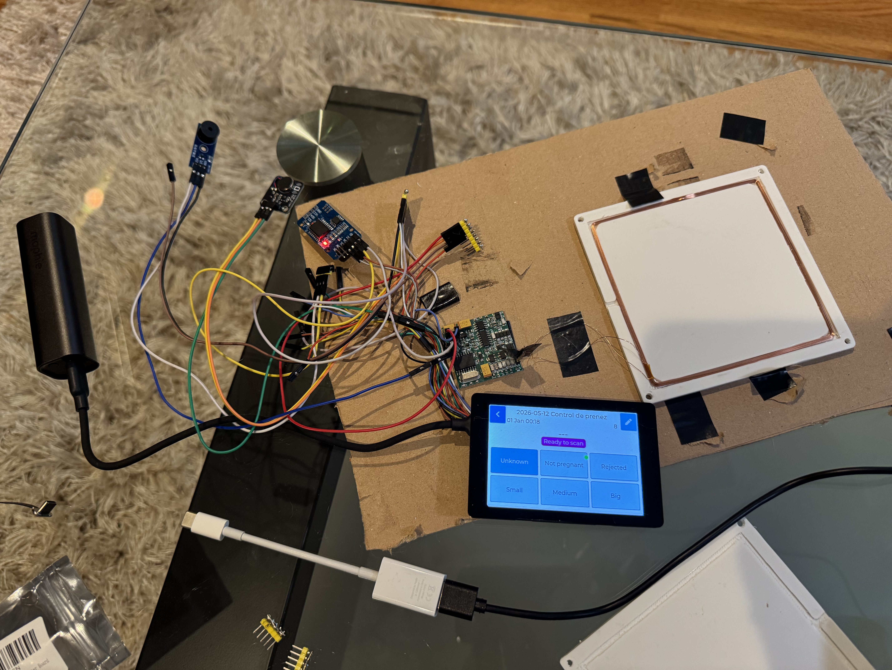
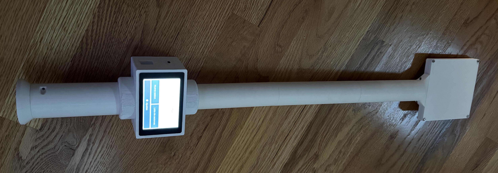
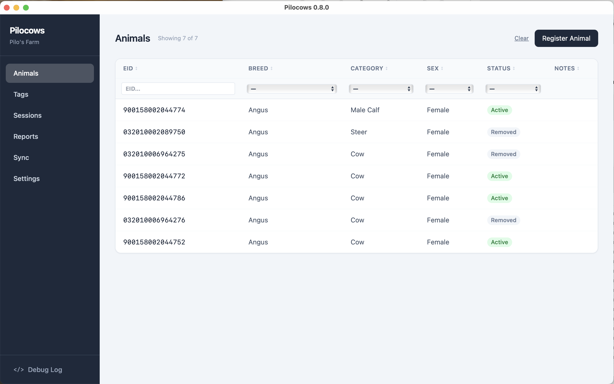

# Pilocows

Animal traceability system for Pilo's farm. Tracks cattle via ISO 11784/85 RFID ear tags (FDX-B, 134.2 kHz, 11-digit EID).

---

## Gallery

| Handheld PCB | 3D-printed enclosure |
|:---:|:---:|
|  |  |

**Desktop app**



**Demo — scanning tags**

[▶ Watch demo](docs/media/demo.mp4)

---

## Architecture

```
┌─────────────────┐        BLE (GATT)         ┌──────────────────────────┐
│   Handheld      │ ◄───────────────────────► │   Frontend (Tauri+React) │
│   ESP32-S3      │    scan list + events     │   macOS / Windows        │
│                 │                           │                          │
│  - RFID scan    │                           │  - BLE central           │
│  - Local store  │                           │  - Animal records UI     │
│  - LVGL UI      │                           │  - EN / ES i18n          │
└─────────────────┘                           └────────────┬─────────────┘
                                                           │ HTTP REST (sidecar)
                                              ┌────────────▼─────────────┐
                                              │   Backend (Rust + Axum)  │
                                              │   SQLite · port 8742     │
                                              └──────────────────────────┘
```

| Sub-project | Stack | Role |
|---|---|---|
| `handheld/` | ESP32-S3 · C++ · ESP-IDF · LVGL | Scans RFID tags, stores sessions, exposes data over BLE |
| `backend/` | Rust · Axum · SQLite | REST API — animals, tags, health records |
| `frontend/` | Tauri 2 · React · TypeScript · Tailwind | Desktop app — BLE sync, animal management UI |

The backend is a standalone binary intentionally decoupled from Tauri so it can be deployed as a cloud service later with no code changes.

---

## Repository Layout

```
pilocows/
├── handheld/               ESP32-S3 firmware (PlatformIO)
│   ├── src/
│   │   ├── board_config.h  Pin definitions
│   │   ├── display/        LCD + touch driver (ST7796UI, FT6336U)
│   │   ├── ble/            GATT server
│   │   ├── rfid/           UART reader driver
│   │   ├── storage/        Session storage (SPIFFS + NVS)
│   │   ├── ui/             LVGL screens
│   │   └── i18n/           String tables (EN / ES)
│   └── platformio.ini
│
├── backend/                Rust REST API
│   ├── src/
│   │   ├── main.rs
│   │   ├── routes/         Axum route handlers
│   │   ├── db/             SQLite query layer
│   │   └── models/         Serde structs
│   ├── migrations/         sqlx migration files
│   └── scripts/            DB utilities (reset, seed)
│
├── frontend/               Tauri + React desktop app
│   ├── src/
│   │   ├── api/            Typed API clients
│   │   ├── components/     Shared UI components
│   │   ├── pages/          Route-level pages
│   │   └── i18n/           en.json / es.json
│   └── src-tauri/          Tauri Rust shell (BLE, sidecar)
│
└── docs/                   API spec, BLE protocol, architecture notes
```

---

## Handheld

### Hardware

| Component | Part |
|---|---|
| MCU board | WT32-S3-WROVER-2-N8R2 (ESP32-S3, 8 MB flash, 2 MB PSRAM) |
| Carrier board | ZX3D50CE02S-USRC-4832 (SC01 Plus by Smart Panlee) |
| Display | ST7796UI 480×320 IPS, 8-bit 8080 parallel |
| Touch | FT6336U, I2C |
| RFID reader | 134.2 kHz FDX-B ISO 11784/85, TTL UART |

### Prerequisites

- [VS Code](https://code.visualstudio.com/) + [PlatformIO extension](https://platformio.org/install/ide?install=vscode)
- Python 3 (for upload scripts)
- USB-C cable connected to the board's native USB port (`/dev/cu.usbmodem101` on macOS — adjust `upload_port` in `platformio.ini` if different)

### Build

```bash
cd handheld

# Build only
pio run -e sc01plus

# Build and flash
pio run -e sc01plus -t upload

# Open serial monitor (115200 baud)
pio device monitor -e sc01plus
```

### Flash port

The default upload port is `/dev/cu.usbmodem101`. If your system assigns a different path:

```ini
# handheld/platformio.ini
upload_port = /dev/cu.usbmodemXXXX
monitor_port = /dev/cu.usbmodemXXXX
```

### Project structure notes

- All pin definitions live in `src/board_config.h` — never hardcode GPIO numbers elsewhere.
- Every user-visible string must go through `i18n_t(STR_...)`. Adding a string requires updating `strings_en.h`, `strings_es.h`, and the lookup table in `i18n.cpp`.

---

## Backend

### Prerequisites

- [Rust](https://rustup.rs/) (stable, 1.75+)
- [sqlx-cli](https://github.com/launchbadge/sqlx/tree/main/sqlx-cli) *(optional — only needed for the dev scripts)*: `cargo install sqlx-cli --no-default-features --features sqlite`

### Setup and run

```bash
cd backend

# Start the server (listens on 127.0.0.1:8742)
# The database file and schema are created automatically on first run.
cargo run
```

The server prints its address on startup. The port is fixed at **8742**.

### Configuration

| Variable | Default | Description |
|---|---|---|
| `DATABASE_URL` | `sqlite://pilocows.db` | SQLite file path |
| `RUST_LOG` | `info` | Log level (`debug`, `info`, `warn`, `error`) |

Set them in a `.env` file in the `backend/` directory or export them before running.

```bash
# backend/.env (example)
DATABASE_URL=sqlite://pilocows.db
RUST_LOG=debug
```

### Useful scripts

```bash
# Wipe all data (prompts for confirmation)
bash scripts/reset_db.sh

# Seed 1 000 animals with 10 health events each
python3 scripts/populate_test_data.py

# Seed with more parallelism
python3 scripts/populate_test_data.py --workers 8 --delay-ms 10
```

### API base URL

```
http://127.0.0.1:8742/api/v1
```

Key resource groups: `/tags`, `/animals`, `/animals/{id}/vaccinations`, `/animals/{id}/pregnancies`, `/animals/{id}/tb-tests`, `/animals/{id}/weights`, `/animals/{id}/removal`, `/sync/scans`.

Full spec: [`docs/api-spec.md`](docs/api-spec.md)

---

## Frontend

### Prerequisites

- [Node.js](https://nodejs.org/) 18+
- [Rust](https://rustup.rs/) (required by Tauri)
- [Tauri prerequisites](https://tauri.app/start/prerequisites/) for your OS (Xcode CLT on macOS, WebView2 on Windows)

```bash
cd frontend
npm install
```

### Development

Run the React UI alone (no Tauri shell, connects to a backend already running on port 8742):

```bash
npm run dev
# open http://localhost:5173
```

Run the full Tauri desktop app (launches the backend sidecar automatically):

```bash
npm run tauri dev
```

### Build distributable

```bash
npm run tauri build
# Output: src-tauri/target/release/bundle/
```

### i18n

Language files are in `src/i18n/en.json` and `src/i18n/es.json`. Language is switchable at runtime via the UI. All visible strings must use the `useTranslation()` hook — no hardcoded text in components.

---

## BLE Protocol (summary)

The handheld acts as a **GATT server**; the desktop app is the central.

| Characteristic | Access | Payload |
|---|---|---|
| `SCAN_LIST` | Read / Notify | JSON array of `{eid, timestamp, event_type, notes}` |
| `DEVICE_STATUS` | Read | `{battery, scan_count, firmware_version}` |
| `CONTROL` | Write | Commands: `clear_list`, `set_time` |

Full spec: [`docs/ble-protocol.md`](docs/ble-protocol.md)

---

## Development workflow

1. **Start the backend** — `cd backend && cargo run`
2. **Start the frontend** — `cd frontend && npm run dev` (or `npm run tauri dev` for the full app)
3. **Flash the handheld** — `cd handheld && pio run -e sc01plus -t upload`
4. Use the frontend's **Sync** tab to connect to the handheld over BLE and import scan sessions.

---

## Build pipeline (Makefile)

A root-level `Makefile` covers building, flashing, versioning, and releasing all three sub-projects.

### Prerequisites

- [PlatformIO CLI](https://docs.platformio.org/en/latest/core/installation/) — for handheld builds
- [Rust](https://rustup.rs/) — for backend builds
- [Node.js](https://nodejs.org/) 18+ — for frontend builds
- [gh CLI](https://cli.github.com/) authenticated — for release targets

### Common targets

```bash
# Show current versions for all sub-projects
make versions

# Build
make build-handheld        # compiles ESP32-S3 firmware
make build-backend         # cargo build --release
make build-frontend        # tauri build
make build-all             # all three

# Build + flash handheld over USB
make flash
```

### Releasing

Each sub-project is released independently under its own tag (`handheld-vX.Y.Z`, `backend-vX.Y.Z`, `frontend-vX.Y.Z`).

```bash
# Handheld — builds locally and uploads firmware to a new GitHub release
make release-handheld

# Backend — pushes the git tag; GitHub Actions builds for macOS arm64,
#            macOS x86_64, and Windows x86_64 and attaches binaries
make release-backend

# Frontend — pushes the git tag; GitHub Actions builds a macOS universal
#             .dmg and a Windows .msi + .exe via tauri-apps/tauri-action
make release-frontend
```

### Typical release flow

```bash
# 1. Bump the version(s) you changed
make bump-backend V=0.2.0

# 2. Commit and push
git add backend/Cargo.toml
git commit -m "Bump backend to 0.2.0"
git push

# 3. Tag and trigger the release
make release-backend
#    → pushes tag backend-v0.2.0
#    → GitHub Actions builds all platforms and publishes the release
```

You can bump multiple sub-projects in the same commit if they ship together.
Set the version once as a shell variable so you only type it once:

```bash
V=0.2.0
make bump-backend  V=$V
make bump-frontend V=$V
git add backend/Cargo.toml frontend/package.json frontend/src-tauri/tauri.conf.json
git commit -m "Bump backend and frontend to $V"
git push
make release-backend
make release-frontend
```

Or use `bump-all` to bump all three sub-projects in one shot:

```bash
make bump-all V=0.2.0
git add backend/Cargo.toml frontend/package.json frontend/src-tauri/tauri.conf.json handheld/VERSION
git commit -m "Bump all to 0.2.0"
git push
make release-backend
make release-frontend
make release-handheld
```
